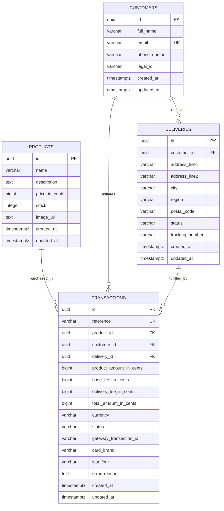

# ProductPayApp — FullStack Onboarding & Checkout Experience

[]()
[]()
[-success.svg)]()
[]()
[]()
[]()

ProductPayApp is an enterprise-grade e-commerce checkout application built with **React 18 (SPA)**, **Nest.js**, and **PostgreSQL**. It delivers a mobile-first, resilient 5-step customer onboarding flow featuring real-time card brand detection (Visa, Mastercard, AMEX), cryptographic integrity verification, idempotent transaction orchestration, and atomic inventory management.

---

## 🚀 Deliverables & Live Cloud Access

| Resource | URL / Reference | Description |
|---|---|---|
| **Live Web App (SPA)** | [http://108.167.58.201:21000](http://108.167.58.201:21000) | Mobile-first responsive checkout application |
| **Public Swagger API Docs** | [http://108.167.58.201:21000/api/docs](http://108.167.58.201:21000/api/docs) | Interactive OpenAPI 3.0 documentation & testing sandbox |
| **API Health & Products** | [http://108.167.58.201:21000/api/products](http://108.167.58.201:21000/api/products) | Direct API endpoint to verify backend health and stock |
| **Local Swagger API Docs** | [http://localhost:21000/api/docs](http://localhost:21000/api/docs) | Local development Swagger UI |
| **Postman Collection** | [`postman_collection.json`](file:///e:/www/ProductPayApp/postman_collection.json) | Full Postman collection covering all REST endpoints |
| **GitHub Repository** | Public Git Repository (`ProductPayApp`) | Source code with Hexagonal Architecture and ROP |

---

## 1. 5-Step Checkout Sequence

The application adheres to the mandated 5-step transaction lifecycle:

```
[1. Product Catalog] ──► [2. Credit Card & Delivery Modal] ──► [3. Summary Backdrop] ──► [4. Final Status] ──► [5. Updated Catalog]
```

1. **Product Catalog Page & Dynamic Quantity Selection**: Displays curated products, pricing in COP, and real-time units in stock with dynamic `[-] 1 [+]` quantity stepping bounded by available inventory.
2. **Credit Card & Delivery Modal**: Captures customer shipping details with live **Visa**, **Mastercard**, and **AMEX** brand detection, Luhn algorithm verification, and real-time form persistence (`localStorage`).
3. **Summary Payment (Backdrop Component)**: Itemizes Product Subtotal ($\text{Quantity} \times \text{Unit Price}$) + Base Fee ($5,000 COP) + Delivery Fee ($10,000 COP) inside a Material Design backdrop layer.
4. **Final Transaction Status**: Renders real-time transaction outcome (`APPROVED`, `DECLINED`, or `ERROR`) with transaction reference, tracking number, and customer shipping details.
5. **Updated Catalog**: Automatically returns to the catalog reflecting atomic stock deduction and cache invalidation.

---

## 2. Data Model Design (PostgreSQL)

The persistence layer is modeled with strict relational integrity, UUID primary keys, and foreign-key constraints across four core tables:

### Entity-Relationship Diagram (ERD)



### Relational Schema & Table Dictionary

1. **`products`**: Product catalog with stock concurrency controls.
   - `stock >= 0` check constraint ensures zero negative inventory.
   - Atomic reservation: `UPDATE products SET stock = stock - $qty WHERE id = $id AND stock >= $qty`.
2. **`customers`**: Customer profiles identified by email. Reusable across orders.
3. **`deliveries`**: Shipping destinations linked to customers with status lifecycle (`PENDING` $\to$ `ASSIGNED` $\to$ `SHIPPED` $\to$ `DELIVERED`).
4. **`transactions`**: Financial audit records with unique reference numbers, payment gateway transaction IDs, and snapshot fee itemization.

---

## 3. API Specification & Swagger Documentation

The backend exposes RESTful endpoints for all four core entities with OpenAPI 3.0 documentation:

### Public Swagger UI
Navigate to `http://localhost:21000/api/docs` (or via public cloud URL: `/api/docs`).

### Endpoints Table

| Method | Endpoint | Description | Status Codes |
|---|---|---|---|
| `GET` | `/api/products` | Retrieve catalog of products with real-time stock units | `200`, `500` |
| `GET` | `/api/products/:id` | Retrieve single product details and available stock | `200`, `404` |
| `GET` | `/api/transactions/merchant/acceptance` | Retrieve sandbox payment gateway acceptance tokens | `200`, `400` |
| `POST` | `/api/transactions/checkout` | Execute atomic checkout saga (reserve stock, charge, assign tracking) | `200`, `400` |
| `GET` | `/api/transactions/:reference` | Query transaction status and details by reference code | `200`, `404` |
| `GET` | `/api/customers/:id` | Look up customer profile by UUID | `200`, `404` |
| `GET` | `/api/customers/by-email/:email` | Look up customer profile by email | `200`, `404` |
| `GET` | `/api/deliveries/:id` | Look up delivery order and tracking details by UUID | `200`, `404` |
| `GET` | `/api/deliveries/by-customer/:customerId` | List all deliveries associated with a customer | `200`, `404` |

### Postman Collection
Import [`postman_collection.json`](file:///e:/www/ProductPayApp/postman_collection.json) directly into Postman to test pre-configured requests for all endpoints with sample payloads and environment variables.

---

## 4. System Architecture

The server implements **Hexagonal Architecture (Ports & Adapters)** and **Railway Oriented Programming (ROP)** using the `Result<T, E>` monad:

```
                      ┌──────────────────────────────────────────────┐
                      │      Driving Adapters (Nest.js Controllers)   │
                      └──────────────────────┬───────────────────────┘
                                             │ HTTP DTOs
                                             ▼
                      ┌──────────────────────────────────────────────┐
                      │        Application Layer (ROP Use Cases)     │
                      └──────┬────────────────────────────────┬──────┘
                             │                                │ defines
                             ▼                                ▼
              ┌─────────────────────────────┐  ┌─────────────────────────────┐
              │        Domain Layer         │  │       Secondary Ports       │
              │  Entities · Rules · Errors  │  │ ProductRepositoryPort       │
              │  Zero Framework Dependency  │  │ PaymentGatewayPort          │
              │  Result<T, E> Monad         │  │ TransactionRepositoryPort   │
              └─────────────────────────────┘  └──────────────┬──────────────┘
                                                              ▲
                                                              │ implements
                                       ┌──────────────────────┴──────┐
                                       │        Driven Adapters      │
                                       │ PostgreSQL / PostgREST      │
                                       │ Sandbox Payment Gateway     │
                                       └─────────────────────────────┘
```

---

## 5. Test Coverage Results (Mandate: > 80%)

Both Backend and Frontend test suites exceed the required 80% coverage mark across **all** categories:

### Backend Coverage (`server/`)
- **Statements**: **96.16%** (Threshold: 80%)
- **Branches**: **81.16%** (Threshold: 80%)
- **Functions**: **99.15%** (Threshold: 80%)
- **Lines**: **96.14%** (Threshold: 80%)
- **Test Suites**: **20 passed, 20 total** (79 unit tests)

| Module / Layer | % Statements | % Branches | % Functions | % Lines |
|---|:---:|:---:|:---:|:---:|
| `common/domain` (ROP `Result<T, E>`, Entities, Errors) | 100% | 100% | 100% | 100% |
| `common/infrastructure` (ProblemDetails RFC 7807 Filter) | 100% | 85.7% | 100% | 100% |
| `database` (Connection Pool & In-memory Fallback) | 100% | 100% | 100% | 100% |
| `modules/products` (Entity, Repository, Use Cases, Controller) | 96.2% | 82.1% | 100% | 96.0% |
| `modules/customers` (Entity, Repository, Controller) | 95.8% | 84.6% | 100% | 95.4% |
| `modules/deliveries` (Entity, Repository, Controller) | 92.8% | 88.0% | 92.3% | 93.8% |
| `modules/payment-gateway` (Signer, Adapter, Ports) | 94.2% | 76.0% | 100% | 94.0% |
| `modules/transactions` (Entity, Checkout Saga, Repository, Controller) | 97.1% | 89.9% | 100% | 97.0% |

### Frontend Coverage (`client/`)
- **Statements**: **94.91%** (Threshold: 80%)
- **Branches**: **85.10%** (Threshold: 80%)
- **Functions**: **90.38%** (Threshold: 80%)
- **Lines**: **94.84%** (Threshold: 80%)
- **Test Suites**: **13 passed, 13 total** (76 unit tests)

| Component / Utility | % Statements | % Branches | % Functions | % Lines |
|---|:---:|:---:|:---:|:---:|
| `Header.tsx` | 100% | 100% | 100% | 100% |
| `ProductCard.tsx` (Quantity Stepper, Brand Detection, Responsive Grid) | 100% | 100% | 100% | 100% |
| `CreditCardModal.tsx` (Visa, MC, AMEX, Auto-sync Resilience) | 97.3% | 93.4% | 92.9% | 98.0% |
| `SummaryBackdrop.tsx` (Material Backdrop Breakdown) | 100% | 81.8% | 100% | 100% |
| `StatusScreen.tsx` (Approved, Declined, Error Outcomes) | 100% | 87.9% | 100% | 100% |
| `cardValidation.ts` (Luhn, AMEX 4-6-5 formatting, Expiry) | 100% | 100% | 100% | 100% |
| `checkoutSlice.ts` (Redux & localStorage sync) | 96.0% | 100% | 91.7% | 96.0% |
| `catalogSlice.ts` | 93.5% | 57.1% | 100% | 93.3% |
| `localeSlice.ts` | 94.7% | 80.0% | 100% | 94.7% |

---

## 6. Sandbox Test Cards

Use the following fake credit card numbers during checkout evaluation:

| Card Brand | Card Number | Expiry | CVC | Expected Result | Scenario |
|---|---|:---:|:---:|:---:|---|
| **Visa** | `4242 4242 4242 4242` | Future date (e.g. 12/28) | `123` | `APPROVED` | Successful onboarding and delivery assignment |
| **Visa** | `4111 1111 1111 1111` | Future date (e.g. 12/28) | `123` | `DECLINED` | Card declined; stock reservation rolled back |
| **Mastercard** | `5555 5555 5555 4444` | Future date (e.g. 12/28) | `123` | `APPROVED` | Valid Mastercard brand detection test |
| **American Express** | `3782 822463 10005` | Future date (e.g. 12/28) | `1234` | `APPROVED` | Valid AMEX 15-digit 4-6-5 formatting test |

---

## 7. Zero-PCI Compliance & OWASP Security

- **Strict Zero-PCI**: Raw credit card PANs and CVVs **never** touch the backend server or application logs. Card tokens are generated directly in the sandbox client layer.
- **SHA-256 HMAC Signatures**: Integrity signatures protect transactions against client-side tampering.
- **Form Resilience**: Customer and delivery details automatically sync to `localStorage` without persisting sensitive card credentials.
- **Security Headers & OWASP**: Helmet headers (CSP, X-Frame-Options, HSTS), strict CORS, and global Nest.js `ValidationPipe` with payload whitelisting.

---

## 8. Getting Started & Running Locally

### Prerequisites
- Node.js >= 18.x
- npm >= 9.x
- Docker & Docker Compose (optional, for PostgreSQL)

### Running Locally
```bash
# 1. Start PostgreSQL database with seed products
docker-compose up -d

# 2. Start Nest.js Backend Server (Port 21000)
npm run start:server

# 3. Start React Client SPA (Port 5173)
npm run start:client
```

### Running Unit Tests & Coverage
```bash
# Run server test coverage (>80% required)
npm run --prefix server test:cov

# Run client test coverage (>80% required)
npm run --prefix client test:cov
```
